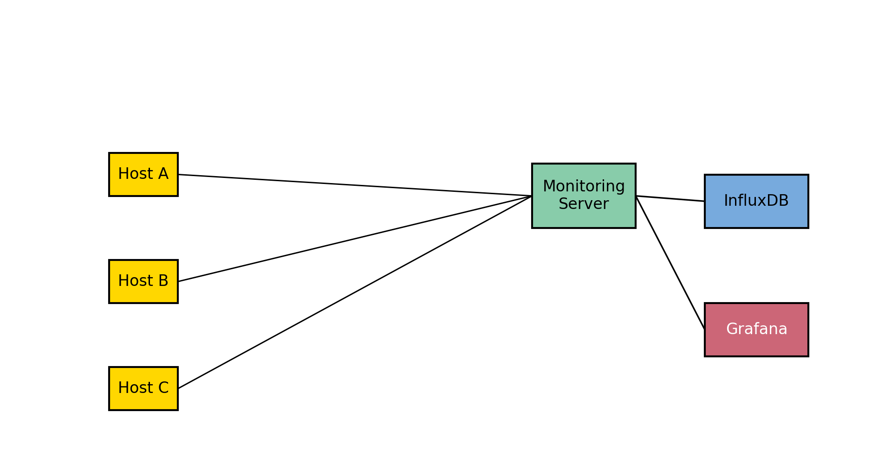
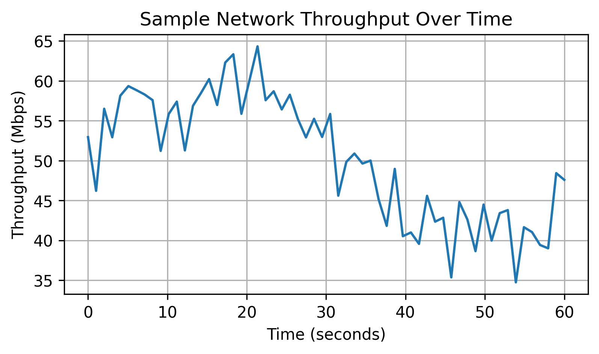

# Network Traffic Analysis with Wireshark & Grafana

This lab demonstrates how to monitor and analyse network traffic using open‑source tools.  By capturing packets on a test network, inspecting the data in Wireshark and visualising metrics in Grafana, you gain insight into both performance and security issues.  The project is designed for a small lab environment but the principles scale to enterprise monitoring.

## Topology

Below is the topology used for this lab.  A monitoring server captures traffic from multiple hosts and exports metrics to a time‑series database.  Grafana queries this database to build dashboards.

## Prerequisites

- A virtualised environment with at least three hosts (e.g. **Kali Linux**, **Ubuntu** and **Windows**).
- **Wireshark** installed on one host to capture packets.
- **InfluxDB** and **Grafana** installed on a monitoring server.  Alternatively you can use **Netdata** or **Prometheus** for metric collection.

## Tools

- **Wireshark** – packet capture and analysis tool.  Enabling TCP sequence number analysis lets Wireshark detect events such as retransmissions, out‑of‑order packets and duplicate ACKs.
- **Grafana** – dashboard platform for visualising time‑series data.  When paired with a database like InfluxDB, Grafana can monitor network health, identify trends and detect issues in real time.
- **InfluxDB/Netdata** – a time‑series database or monitoring agent to store network metrics for Grafana.

## Steps

### 1. Set up the environment

1. Create a small virtual network with at least three hosts (for example, Kali, Ubuntu and Windows) and ensure they can communicate.
2. Install **Wireshark** on one host and **InfluxDB** and **Grafana** on a dedicated monitoring server (or use Netdata/Prometheus).
3. Generate traffic between hosts by transferring large files or simulating web requests.

### 2. Capture traffic

1. Launch Wireshark on the chosen host and start a capture on the network interface connected to your lab network.
2. Record packets while your hosts transfer data.  Save the capture to a `.pcap` file when complete.

### 3. Analyse the data

1. Open the capture in Wireshark and enable **Analyse → TCP → Analyse Sequence Numbers** to allow Wireshark to flag retransmissions, out‑of‑order segments and duplicate ACKs.
2. Identify the most common protocols in the capture.  Look for performance issues such as retransmissions, high latency, or duplicate acknowledgements.
3. Conduct a security analysis: search for unusual patterns like port scans, unencrypted credentials or suspicious payloads.

### 4. Visualise metrics

1. On the monitoring server, configure **InfluxDB** (or Netdata/Prometheus) to receive metrics from network interfaces or from the captured data.  For example, you can feed network throughput data into InfluxDB.
2. In Grafana, create a dashboard that queries InfluxDB for network metrics (bytes per second, packets per second, etc.).  Grafana’s ability to visualise trends over time helps you quickly identify spikes and anomalies.
3. Use the sample throughput graph below as inspiration.  As you build dashboards, experiment with different visualisations (line charts, gauges, bar charts) to best represent your data.

### 5. Document findings

1. Summarise your observations in a report.  Describe performance issues (e.g. duplicate ACKs, retransmissions), unusual traffic patterns and any security concerns discovered.
2. Include screenshots from Wireshark and Grafana dashboards to support your conclusions.

## Next Steps

- Integrate **alerting** in Grafana to notify you when traffic exceeds thresholds or when suspicious patterns emerge.
- Expand the lab by adding additional protocols (e.g. VoIP, DNS) and monitor how they impact traffic patterns.
- Combine this monitoring setup with intrusion detection systems (IDS) or security information and event management (SIEM) tools to gain deeper security insights.
